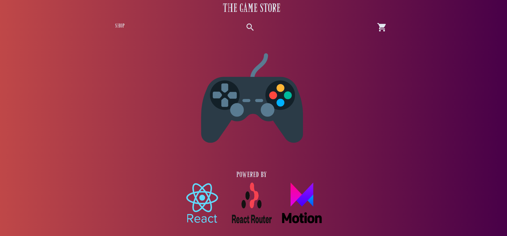

# Odin Shopping Cart
The Odin Shopping Cart project is designed as a game store for users to shop for their favorite video game. The user can 
shop through 6 categories: Adventure, Fighting, RPG, Racing, Shooters, and sports.

Each category will have 5 games that the user can add to their cart with a selection of platforms
that it can be played on. 

The product quantity can be increased or decreased in the cart. Clicking the checkout button will navigate the user back
to the home page with an empty cart. 

The user may also search for the game in the search field to avoid navigating through the shopping list. 

## THE GAME STORE

 

